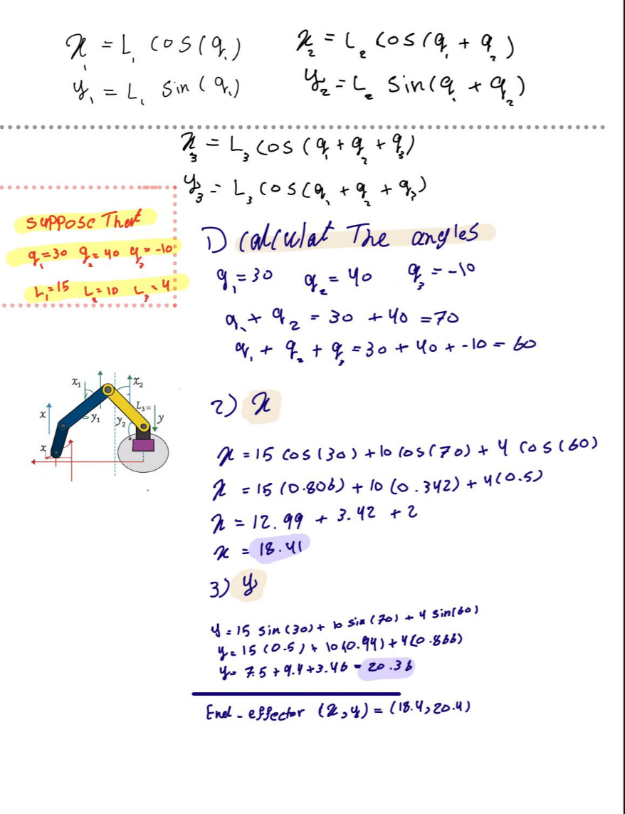

# 🤖 Robotic Arm Forward Kinematics  

This project calculates the *end-effector position (x, y)* of a *3-link planar robotic arm* using trigonometric equations.  
It demonstrates the mathematical steps of forward kinematics in a simple and clear way.

---

## 📐 Overview  

Given:
- Link lengths → \( L_1, L_2, L_3 \)
- Joint angles → \( q_1, q_2, q_3 \)

The end-effector position is calculated as:

\[
x = L_1\cos(q_1) + L_2\cos(q_1 + q_2) + L_3\cos(q_1 + q_2 + q_3)
\]
\[
y = L_1\sin(q_1) + L_2\sin(q_1 + q_2) + L_3\sin(q_1 + q_2 + q_3)
\]

---

## 🧮 Example  

For:
- \( L_1 = 15 \,cm \)
- \( L_2 = 10 \,cm \)
- \( L_3 = 4 \,cm \)
- \( q_1 = 30° \)
- \( q_2 = 40° \)
- \( q_3 = -10° \)

*Calculation steps:*
- \( q_1 + q_2 = 70° \)
- \( q_1 + q_2 + q_3 = 60° \)

\[
x = 15\cos(30) + 10\cos(70) + 4\cos(60) = 18.41
\]
\[
y = 15\sin(30) + 10\sin(70) + 4\sin(60) = 20.38
\]

✅ *End-effector position:*  
\[
(x, y) = (18.4,\ 20.4)
\]

---

## 🖼 Diagram  

---

